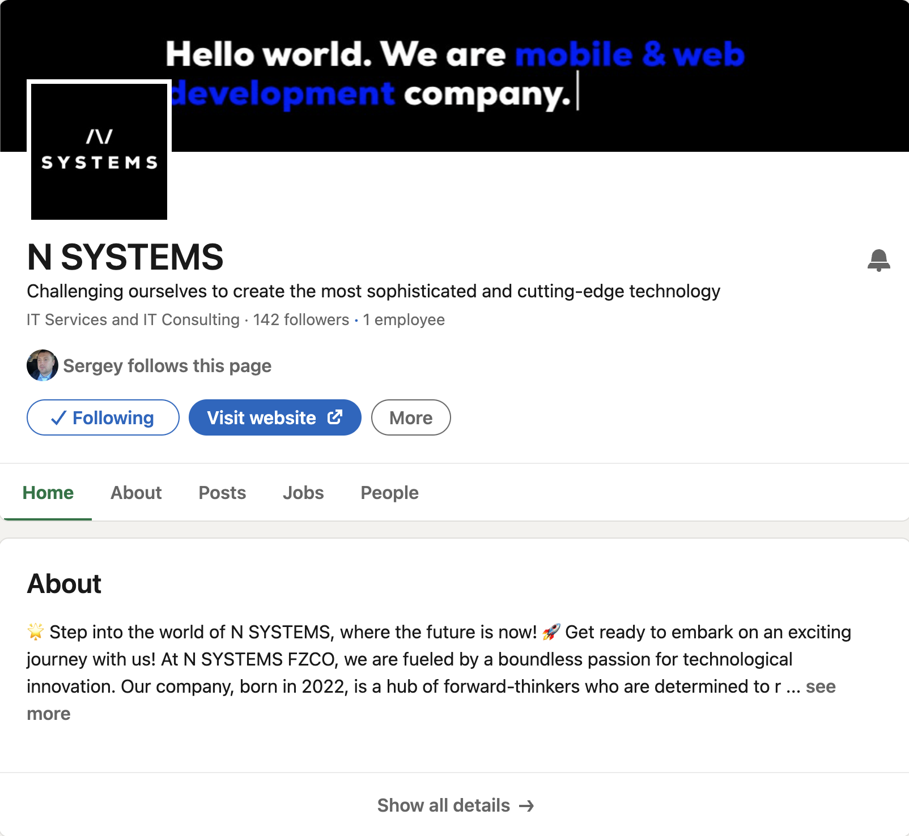
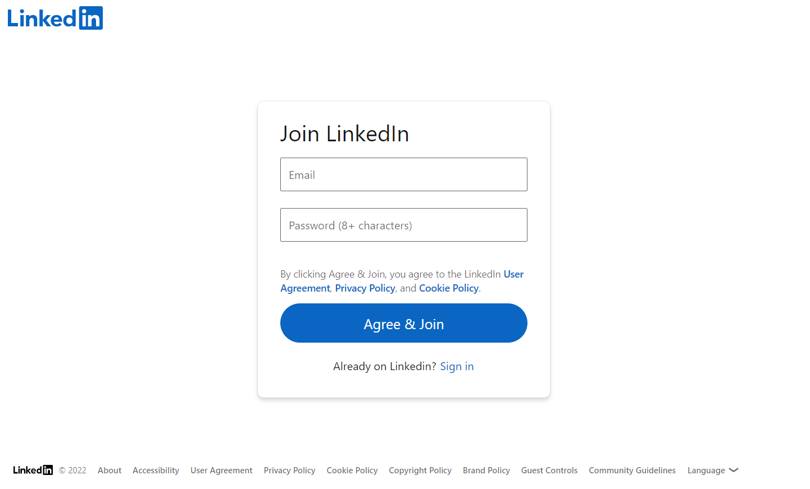

<p align="center">
  <a href="https://www.linkedin.com/company/n-systems-software/"></a>
</p>

LinkedIn is the most up-to-date and extensive source of professional people profiles on the internet. As a result it is the most popular web scraping target of recruiting, HR and lead generation companies.

In this repo we focused on building a production LinkedIn spider using Python Scrapy that scrape LinkedIn Public People and Company Profiles.

Example of running scraper for company pages:

```bash
scrapy crawl linkedin_company_profile -a source_csv=company_profiles.csv
```

The output of this code will look like this:

```csv
name,summary,industry,size
N SYSTEMS,Challenging ourselves to create the most sophisticated and cutting-edge technology,IT Services and IT Consulting,11-50 employees
BrainTrust,not-found,Software Development,2-10 employees
Centraprise,Working with simple Aim to keep  all the Consultants and Customers Happy,IT Services and IT Consulting,"501-1,000 employees"
```

Example of running scraper to parse the people profile page:

```bash
scrapy crawl linkedin_people_profile
```

The output of this code will look like this:

```json
{
    "profile": "reidhoffman", 
    "url": "https://www.linkedin.com/in/reidhoffman/", 
    "name": "Reid Hoffman", 
    "description": "All aspects of consumer internet and software.  Focus is on product development, innovation, business strategy, and finance, but includes general management, operations, business operations, business development, talent management, and marketing.  Strong experience in both seed-stage companies (paypal, linkedin, facebook, zynga, last.fm, flickr) and growth companies (mozilla, linkedin, zynga, paypal.)", 
    "location": "United States", 
    "followers": "3M", 
    "connections": "500+", 
    "experience": [{"organisation_profile": "https://www.linkedin.com/company/greylock-partners", "location": "Menlo Park, CA", "description": "Greylock partners with entrepreneurs to build market-transforming companies.  Notable Greylock portfolio includes companies like Linkedin, Airbnb, Facebook, Workday, Roblox, Palo Alto Networks, Dropbox, Pure Storage, Convoy, Pandora, Instagram and Discord.  I represent Greylock on the boards of Aurora, Coda, Convoy, Entrepreneur First, Magical Tome, Nauto, and Neeva.", "start_time": "Nov 2009", "end_time": "present", "duration": "13 years"}, {"organisation_profile": "https://www.linkedin.com/company/microsoft", "location": "Seattle, Washington, United States", "description": "Microsoft's mission is to empower every person and every organization on the planet to achieve more.", "start_time": "Mar 2017", "end_time": "present", "duration": "5 years 8 months"}, {"organisation_profile": "", "location": "Palo Alto, California, United States", "description": "Throughout the history of computing, humans have had to learn to speak the language of machines. In the new paradigm, machines will understand our language.", "start_time": "Mar 2022", "end_time": "present", "duration": "8 months"}, {"organisation_profile": "https://www.linkedin.com/company/auroradriver", "location": "Palo Alto, California, United States", "description": "Aurora delivers the benefits of self-driving technology quickly and safely around the world.", "start_time": "Jan 2018", "end_time": "present", "duration": "4 years 10 months"}, {"organisation_profile": "https://www.linkedin.com/company/jobyaviation", "location": "Santa Cruz, California, United States", "description": "Making our city's transportation grid 3-D: safe, climate healthier, and fast.", "start_time": "Aug 2021", "end_time": "present", "duration": "1 year 3 months"}, {"organisation_profile": "https://www.linkedin.com/company/convoy-inc", "location": "Greater Seattle Area", "description": "On demand local and regional trucking.", "start_time": "Jan 2016", "end_time": "present", "duration": "6 years 10 months"}, {"organisation_profile": "https://www.linkedin.com/company/nauto", "location": "Palo Alto, CA", "description": "Artificial intelligence cloud data platform to improve transportation safety, develop autonomy, and improve urban mobility.", "start_time": "Aug 2017", "end_time": "present", "duration": "5 years 3 months"}, {"organisation_profile": "https://www.linkedin.com/company/codainc", "location": "Palo Alto, CA", "description": "Docs are the new apps. Coda is on a mission to make documents the platform for applications. Coda reinvents shared, live-data in docs from the ground up. Coda docs erase the boundaries between words and data. And make it so everyone can work together, in their own way, off a single source of truth.", "start_time": "Oct 2014", "end_time": "present", "duration": "8 years 1 month"}, {"organisation_profile": "https://www.linkedin.com/company/neevaco", "location": "Mountain View, California, United States", "description": "Neeva is search re-imagined. Always ad-free, private, and personal.  Co-founded by Sridhar Ramaswamy (ex-SVP of Ads at Google) and Vivek Raghunathan (ex-VP of Monetization at YouTube).", "start_time": "Jan 2019", "end_time": "present", "duration": "3 years 10 months"}, {"organisation_profile": "https://www.linkedin.com/company/entrepreneur-first", "location": "London, United Kingdom", "description": "Turning exceptional individuals into exceptional founders.", "start_time": "Sep 2017", "end_time": "present", "duration": "5 years 2 months"}, {"organisation_profile": "https://www.linkedin.com/company/blockstream", "location": "San Francisco Bay Area", "description": "Blockstream was founded to develop new ways to accelerate innovation in crypto currencies, open assets and smart contracts.", "start_time": "Nov 2014", "end_time": "present", "duration": "8 years"}, {"organisation_profile": "https://www.linkedin.com/company/reinventcapital", "location": "", "description": "Reinvent partners with bold leaders of category-defining companies to help them grow and innovate at scale.", "start_time": "Aug 2018", "end_time": "present", "duration": "4 years 3 months"}, {"organisation_profile": "", "location": "Oxford, United Kingdom", "description": "A wonderful, modern graduate college at Oxford.  My alma matter college.", "start_time": "Oct 2016", "end_time": "present", "duration": "6 years 1 month"}], 
    "education": [{"organisation": "University of Oulu", "organisation_profile": "https://www.linkedin.com/school/university-of-oulu/", "course_details": "Honorary Doctor Faculty of Information Technology and Electrical Engineering", "description": "The University of Oulu is an international science university which creates new knowledge, well-being and innovations for the future through research and education. The University of Oulu, founded in 1958, is one of the biggest and most multidisciplinary universities in Finland.", "start_time": "2020", "end_time": "2020"}, {"organisation": "Babson College", "organisation_profile": "https://www.linkedin.com/school/babson-college/", "course_details": "Honorary Doctor of Laws Entrepreneurship/Entrepreneurial Studies", "description": "", "start_time": "2012", "end_time": "2012"}, {"organisation": "Oxford University", "organisation_profile": "https://www.linkedin.com/school/oxforduni/", "course_details": "M.St. Philosophy", "description": "Activities and Societies: Wolfson College, Matthew Arnold Prize (Proxime Accessit)", "start_time": "1990", "end_time": "1993"}, {"organisation": "Stanford University", "organisation_profile": "https://www.linkedin.com/school/stanford-university/", "course_details": "B.S. Symbolic Systems", "description": "Activities and Societies: Marshall Scholar, Dinkelspiel Award, Golden Grant, Founder of the Symbolic Systems Forum", "start_time": "1985", "end_time": "1990"}, {"organisation": "The Putney School", "organisation_profile": "", "course_details": "Diploma Highschool", "description": "Activities and Societies: X-country skiing, soccer, rebuilding Nova Scotia house", "start_time": "1982", "end_time": "1985"}]
}
```

This spider scrapes the following data from the LinkedIn profile page:

* Name
* Description
* Number of followers
* Number of connections
* Location
* About
* Experienes - organisation name, organisation profile link, position, start & end dates, description.
* Education - organisation name, organisation profile link, course details, start & end dates, description.

You can expand this spider to scrape other details like volunteering, certifications, skills, publications, etc. by simply adding more parsers to the `parse_profile` method.

## Storing Data To Database Or S3 Bucket

With Scrapy, it is very easy to save our scraped data to JSON lines files, databases or file storage systems (like AWS S3) using Scrapy's Feed Export functionality.

To configure Scrapy to save all our data to a new JSON lines file everytime we run the scraper we simply need to create a **Scrapy Feed** and configure a dynamic file path.

If we add the following code to our settings.py file, Scrapy will create a new JSON lines file in our data folder using the **spider name** and **time the spider was run**.

```python
# settings.py 

FEEDS = {
    'data/%(name)s_%(time)s.jsonl': {
        'format': 'jsonlines',
    }
}
```

## Saving CSV Files To AWS S3 Bucket

Configuring Scrapy to save our S3 bucket is very simple. We just need to update the `settings.py` with the following:

```python
# settings.py

FEEDS = {
    "s3://scrapy-playbook/%(name)s/%(name)s_%(time)s.csv": {
    "format": "csv",
    }
}

AWS_ACCESS_KEY_ID = 'YOUR_AWS_ACCESS_KEY_ID'
AWS_SECRET_ACCESS_KEY = 'YOUR_AWS_SECRET_ACCESS_KEY'
```

## Bypassing LinkedIn's Anti-Bot Protection

LinkedIn has one of the most aggressive anti-scraping systems on the internet, making it very hard to scrape.

It uses a combination of IP address, headers, browser & TCP fingerprinting to detect scrapers and block them.

As you might have seen already, if you run the above code LinkedIn is likely blocking your requests and returning their login page like this:

<p align="center">

</p>

> **Note**
> This Scrapy spider is only designed to scrape public LinkedIn people profiles that don't require you to login to view. Scraping behind LinkedIn's login is significantly harder and opens yourself up to much higher legal risks.

To bypass LinkedIn's anti-scraping system will need to using very high quality rotating residential/mobile proxies, browser-profiles and a fortified headless browser.

However, if you don't want to implement all this anti-bot bypassing logic yourself, the easier option is to use a smart proxy solution like ScrapeOps Proxy Aggregator which integrates with over 20+ proxy providers and finds the proxy solution that works best for LinkedIn for you.

The **ScrapeOps Proxy Aggregator** is a smart proxy that handles everything for you:

* Proxy rotation & selection
* Rotating user-agents & browser headers
* Ban detection & CAPTCHA bypassing
* Country IP geotargeting
* Javascript rendering with headless browsers

You can get a **ScrapeOps API key** with **1,000 free API credits** by signing up [here](https://scrapeops.io/app/register/proxy).

To use the **ScrapeOps Proxy Aggregator** with our LinkedIn Scrapy Spider, we just need to send the URL we want to scrape to the Proxy API instead of making the request directly ourselves. You can test it out with Curl using the command below:

```bash
curl 'https://proxy.scrapeops.io/v1/?api_key=YOUR_API_KEY&url=https://www.linkedin.com/company/n-systems-software/
```

We can integrate the proxy easily into our scrapy project by installing the ScrapeOps Scrapy Proxy SDK a Downloader Middleware. We can quickly install it into our project using the following command:

```bash
pip install scrapeops-scrapy-proxy-sdk
```

And then enable it in your project in the `settings.py` file.

```python
## settings.py

SCRAPEOPS_API_KEY = 'YOUR_API_KEY'
SCRAPEOPS_PROXY_ENABLED = True

DOWNLOADER_MIDDLEWARES = {
    'scrapeops_scrapy_proxy_sdk.scrapeops_scrapy_proxy_sdk.ScrapeOpsScrapyProxySdk': 725,
}
```

Now when we make requests with our scrapy spider they will be routed through the proxy and LinkedIn won't block them.
